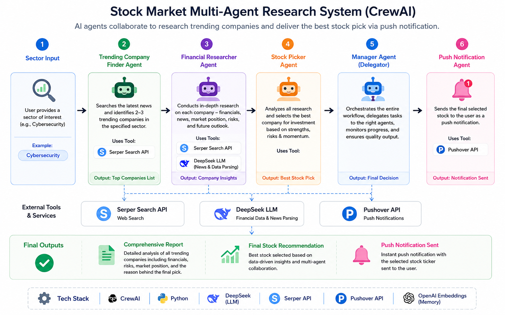
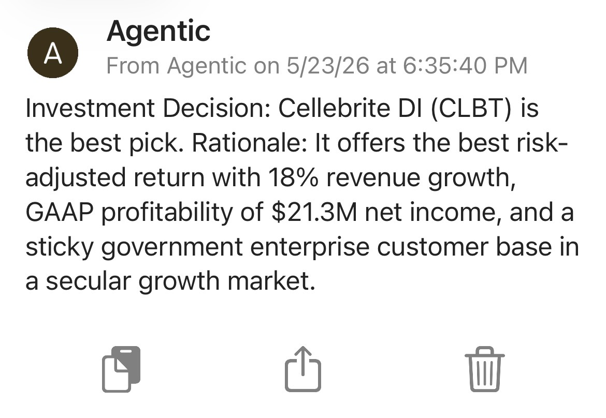

# CrewAI Multi-Agent Stock Picker

An AI-powered multi-agent investment research system built using CrewAI, DeepSeek LLMs, OpenAI embeddings, Serper web search, and Pushover notifications.

The system autonomously discovers trending companies, performs financial research, evaluates investment potential, and selects the strongest stock opportunity using a hierarchical CrewAI workflow with delegated agent collaboration.

---

# Project Overview

This project was built to explore how autonomous AI agents can collaborate on real-world financial analysis tasks using CrewAI.

Instead of a single chatbot handling everything, the system uses multiple specialized AI agents that:

- Discover trending companies from live news
- Perform detailed financial research
- Compare investment opportunities
- Select the strongest stock pick
- Send real-time push notifications with the final investment decision

The workflow mimics a miniature AI-powered investment research team with delegation, memory, tool usage, and reasoning across multiple agents.

---

# Key Features

- Multi-agent CrewAI architecture
- Hierarchical manager delegation workflow
- Real-time web search using SerperDevTool
- AI-driven financial analysis and stock selection
- Persistent memory using CrewAI memory systems
- OpenAI embedding-based RAG memory
- Real-time mobile push notifications using Pushover
- Structured outputs using Pydantic models
- Autonomous agent collaboration and task delegation

---

# Agent Workflow

## 1. Trending Company Finder

Responsible for searching recent financial/news trends and identifying promising companies for deeper research.

### Responsibilities
- Search latest news
- Identify trending technology companies
- Avoid duplicate company selection
- Pass shortlisted companies to the researcher agent

### Tools Used
- SerperDevTool

### LLM
- DeepSeek Chat

---

## 2. Financial Researcher

Performs detailed analysis on each trending company.

### Responsibilities
- Analyze company financials
- Evaluate market position
- Assess future outlook
- Estimate investment potential

### Tools Used
- SerperDevTool

### LLM
- DeepSeek Chat

---

## 3. Stock Picker

Acts as the final investment decision-maker.

### Responsibilities
- Compare all researched companies
- Evaluate risk-adjusted opportunities
- Select the strongest investment candidate
- Send push notifications to the user
- Generate final investment report

### Tools Used
- Custom Pushover Notification Tool

### LLM
- DeepSeek Chat

---

## 4. Manager Agent

Coordinates the entire CrewAI workflow.

### Responsibilities
- Delegate tasks between agents
- Manage workflow execution
- Coordinate final decision-making

### Workflow Type
- Hierarchical Process

---

# Workflow Architecture



---

# Memory System

This project uses CrewAI memory systems to simulate persistent multi-agent reasoning.

## Long-Term Memory
- SQLite-based persistent storage
- Stores information across runs/sessions

## Short-Term Memory
- RAG-based contextual memory
- Uses OpenAI embeddings (`text-embedding-3-small`)

## Entity Memory
- Tracks entities such as companies, sectors, and research context

---

# Push Notifications

The project sends real-time mobile notifications using the Pushover API whenever an investment decision is finalized.

## Example Notifications

### Notification Example 1


### Notification Example 2


---

# Example Final Decision

The system analyzed 10 trending technology companies and selected:

## Cellebrite DI (CLBT)

### Why It Was Selected
- GAAP profitable
- Strong revenue growth
- High ARR growth
- Strong future guidance
- Sticky enterprise/government customer base
- Strong risk-adjusted investment profile

The final report also compared:
- SoundHound AI
- Rocket Lab
- IonQ
- Innodata
- Rigetti
- C3.ai
- BigBear.ai
- Serve Robotics
- Aehr Test Systems

---

# Tech Stack

## AI / Agent Frameworks
- CrewAI
- CrewAI Tools

## LLMs
- DeepSeek Chat
- OpenAI Embeddings

## Search & Retrieval
- Serper API
- RAG Memory

## Notifications
- Pushover API

## Backend / Infrastructure
- Python
- Pydantic
- SQLite

---

# Project Structure

```text
crewai-stock-picker-agent/
│
├── images/
│   ├── notify1.jpg
│   ├── notify2.jpg
│   └── workflow.png
│
├── output/
│
├── pyproject.toml
├── README.md
│
└── src/
    └── stock_picker/
        ├── __init__.py
        ├── crew.py
        ├── main.py
        │
        ├── config/
        │   ├── agents.yaml
        │   └── tasks.yaml
        │
        └── tools/
            ├── __init__.py
            └── push_tool.py
```

---

# Installation

## 1. Clone Repository

```bash
git clone https://github.com/aditya-ailsinghani/crewai-stock-picker-agent.git
cd crewai-stock-picker-agent
```

---

## 2. Create Virtual Environment

```bash
python3 -m venv .venv
source .venv/bin/activate
```

---

## 3. Install Dependencies

```bash
pip install crewai crewai-tools openai requests
```

---

# Environment Variables

Create a `.env` file in the root directory.

```env
OPENAI_API_KEY=your_openai_key
SERPER_API_KEY=your_serper_key
PUSHOVER_USER=your_pushover_user
PUSHOVER_TOKEN=your_pushover_token
```

---

# Running the Project

```bash
python src/stock_picker/main.py
```

---

# Example CrewAI Capabilities Demonstrated

- Multi-agent collaboration
- Tool calling
- Autonomous delegation
- Agent memory
- RAG-based context retention
- Structured outputs
- Real-time notifications
- AI-generated financial analysis
- Hierarchical orchestration

---

# Future Improvements

- Add stock market APIs for live pricing
- Portfolio optimization agent
- Risk scoring agent
- Historical backtesting
- Streamlit dashboard
- Multi-sector investment analysis
- Scheduled recurring analysis
- Vector database integration
- Multi-model ensemble reasoning

---

# Disclaimer

This project is intended for educational and experimental purposes only and should not be considered financial advice.

---

# Author

Aditya Ailsinghani

M.S. Data Science, Analytics, and Engineering  
Arizona State University

Focused on:
- Agentic AI Systems
- Machine Learning
- Data Engineering
- Multi-Agent Workflows
- AI Automation
